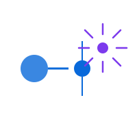

# gh-webhook-monitor



A local server that receives GitHub webhook events and spawns AI agents (Claude Code or Codex CLI) to handle them automatically. When someone posts a code review, opens an issue, or CI fails, the agent investigates and fixes the problem.

## How it works

```
GitHub event (PR review, issue, CI failure)
  -> GitHub sends POST to your public URL
  -> Cloudflare Tunnel routes to localhost:3847
  -> Server verifies HMAC signature, routes event
  -> Spawns AI agent (Claude Code or Codex CLI) in the repo directory
  -> Agent reads context, makes code changes, creates PRs
  -> Server reacts with emoji on the issue (eyes=working, rocket=done)
```

## Prerequisites

- **Node.js** >= 18
- **GitHub CLI** (`gh`) installed and authenticated (`gh auth login`)
- **AI agent** - one of:
  - [Claude Code](https://docs.anthropic.com/en/docs/claude-code) (`npm install -g @anthropic-ai/claude-code`)
  - [Codex CLI](https://github.com/openai/codex) (`npm install -g @openai/codex`)
- **cloudflared** - Cloudflare Tunnel client (see [docs/cloudflare-setup.md](docs/cloudflare-setup.md))

## Quick start

### 1. Clone and install

```bash
git clone <this-repo-url> gh-webhook-monitor
cd gh-webhook-monitor
npm install
```

### 2. Generate config

```bash
# Create .env with a random webhook secret
SECRET=$(openssl rand -hex 32)
cat > .env <<EOF
WEBHOOK_SECRET=$SECRET
PORT=3847
EOF

# Start the server once to generate config.json with defaults
node server.js &
sleep 2
kill %1

echo ""
echo "Your webhook secret: $SECRET"
echo "Save this - you'll need it when adding the GitHub webhook."
```

### 3. Configure your repos

Edit `config.json` or use the web dashboard (http://localhost:3847 once running):

```json
{
  "repos": {
    "your-org/your-repo": {
      "localPath": "/path/to/local/checkout",
      "enabled": true
    }
  }
}
```

Each repo must have a local git checkout that the AI agent can work in.

### 4. Set up Cloudflare Tunnel

You need a public URL so GitHub can reach your local server. See [docs/cloudflare-setup.md](docs/cloudflare-setup.md) for detailed instructions.

**Quick version (temporary URL):**

```bash
cloudflared tunnel --url http://localhost:3847
# Note the https://*.trycloudflare.com URL printed
```

**Permanent URL (recommended):**

```bash
cloudflared tunnel create gh-webhook
cloudflared tunnel route dns gh-webhook gh-webhook.yourdomain.com
# Then use the config in docs/cloudflare-setup.md
```

### 5. Add GitHub webhook

Using the GitHub CLI:

```bash
# Replace with your values
REPO="your-org/your-repo"
WEBHOOK_URL="https://gh-webhook.yourdomain.com/webhook"
SECRET="<your-webhook-secret-from-step-2>"

gh api repos/$REPO/hooks --method POST \
  --field name=web \
  --field active=true \
  --field "config[url]=$WEBHOOK_URL" \
  --field "config[content_type]=json" \
  --field "config[secret]=$SECRET" \
  --field "config[insecure_ssl]=0" \
  --field "events[]=pull_request" \
  --field "events[]=pull_request_review" \
  --field "events[]=check_suite" \
  --field "events[]=issues" \
  --field "events[]=issue_comment"
```

Or manually: go to your repo's **Settings > Webhooks > Add webhook** and configure:
- Payload URL: `https://gh-webhook.yourdomain.com/webhook`
- Content type: `application/json`
- Secret: your webhook secret
- Events: Pull requests, Pull request reviews, Check suites, Issues, Issue comments

### 6. Create recommended labels

```bash
REPO="your-org/your-repo"
gh label create agent-task --repo $REPO --color 7C3AED --description "Issue for AI agent to investigate and fix"
gh label create agent-authored --repo $REPO --color 10B981 --description "PR created by AI agent"
```

### 7. Start the server

```bash
# With tunnel
./start.sh

# Or just the server (if tunnel is running separately)
node server.js
```

### 8. Verify

```bash
# Health check
curl http://localhost:3847/api/health

# Send a test ping from GitHub
gh api repos/your-org/your-repo/hooks/<webhook-id>/pings --method POST

# Check it was received
tail logs/events.log
```

## Usage

### Creating tasks for the agent

Create a GitHub issue with the `agent-task` label:

```bash
gh issue create --repo your-org/your-repo \
  --title "Fix the login redirect bug" \
  --body "When users log in, they get redirected to /undefined instead of /dashboard. Investigate and fix." \
  --label agent-task
```

The agent will:
1. React with :eyes: emoji (acknowledged)
2. Read the issue, investigate the codebase
3. Create a PR with the fix
4. Comment on the issue with a summary
5. React with :rocket: emoji (done) or :confused: (failed)

### Supported events

| Event | What triggers it | What the agent does |
|---|---|---|
| **Issue with `agent-task` label** | You create an issue | Investigates, implements, creates PR |
| **Issue with `deploy-failure`/`auto-fix` label** | Automated systems | Investigates and fixes |
| **PR review** (changes requested or comments) | CodeRabbit or human reviews code | Reads comments, fixes code, pushes |
| **Issue/PR comment with trigger keyword** | Someone writes `@claude` or `please fix` | Reads comment, acts on it |
| **CI failure on default branch** | Tests/build break | Investigates logs, fixes, pushes |
| **Follow-up comment on agent issue** | You reply to an agent issue | Reads thread, continues work |

### Anti-loop safeguards

The server prevents infinite loops (agent creates PR -> bot reviews -> agent reacts -> ...) with:

- **5-minute cooldown** per issue after handling
- **Bot reviews on `agent-authored` PRs are skipped** (only human reviews trigger action)
- **Job deduplication** (same job can't run twice concurrently)
- **Configurable max concurrent jobs** (default: 3)
- **Job timeout** (default: 15 minutes, then SIGTERM)
- **Ignored bots list** (github-actions[bot], dependabot[bot])

## Web dashboard

Open http://localhost:3847 in your browser.

| Tab | What it shows |
|---|---|
| **Dashboard** | Active jobs with live output, recent events |
| **Repos** | Add/remove/enable/disable monitored repositories |
| **Agent** | Switch between Claude Code and Codex CLI, configure model/reasoning |
| **Prompts** | Edit prompt templates per event type with `{{variable}}` placeholders |
| **Settings** | Event toggles, trigger keywords, labels, ignored bots, limits |
| **Jobs** | Active jobs with kill button, job history with log viewer |
| **Events** | Full event log |

## Agent configuration

### Claude Code (default)

```json
{
  "agent": {
    "type": "claude",
    "claude": {
      "bin": "claude",
      "model": "",
      "extraArgs": "--dangerously-skip-permissions"
    }
  }
}
```

| Setting | Values | Default |
|---|---|---|
| `model` | `""` (auto), `sonnet`, `opus`, `haiku` | `""` (auto) |
| `extraArgs` | Any CLI flags | `--dangerously-skip-permissions` |

### Codex CLI

```json
{
  "agent": {
    "type": "codex",
    "codex": {
      "bin": "codex",
      "model": "gpt-5.3-codex",
      "reasoningEffort": "high",
      "sandbox": "workspace-write",
      "extraArgs": "--full-auto"
    }
  }
}
```

| Setting | Values | Default |
|---|---|---|
| `model` | `gpt-5.3-codex`, `o4-mini`, etc. | `gpt-5.3-codex` |
| `reasoningEffort` | `xhigh`, `high`, `medium`, `low` | `high` |
| `sandbox` | `read-only`, `workspace-write`, `danger-full-access` | `workspace-write` |
| `extraArgs` | Any CLI flags | `--full-auto` |

Switch between agents via the web dashboard **Agent** tab or by editing `config.json`.

## Prompt templates

Each event type has an editable prompt template with `{{variable}}` placeholders. Edit them in the **Prompts** tab or in `config.json` under `promptTemplates`.

Available variables per event:

| Event | Variables |
|---|---|
| `pull_request_review` | `prNumber`, `prTitle`, `reviewer`, `reviewState`, `repo` |
| `check_suite` | `branch`, `sha`, `repo` |
| `issues` | `issueNumber`, `issueTitle`, `action`, `labels`, `repo` |
| `issue_comment` | `prNumber`, `prTitle`, `author`, `body`, `repo` |
| `agent_task` | `issueNumber`, `issueTitle`, `issueBody`, `labels`, `repo` |
| `issue_followup` | `issueNumber`, `issueTitle`, `author`, `body`, `labels`, `repo` |

## Running as a service (macOS)

To auto-start on login and restart on crash:

```bash
# Create the launchd plist
cat > ~/Library/LaunchAgents/com.gh-webhook-monitor.plist <<'EOF'
<?xml version="1.0" encoding="UTF-8"?>
<!DOCTYPE plist PUBLIC "-//Apple//DTD PLIST 1.0//EN" "http://www.apple.com/DTDs/PropertyList-1.0.dtd">
<plist version="1.0">
<dict>
    <key>Label</key>
    <string>com.gh-webhook-monitor</string>
    <key>ProgramArguments</key>
    <array>
        <string>/path/to/gh-webhook-monitor/start.sh</string>
    </array>
    <key>WorkingDirectory</key>
    <string>/path/to/gh-webhook-monitor</string>
    <key>RunAtLoad</key>
    <true/>
    <key>KeepAlive</key>
    <true/>
    <key>StandardOutPath</key>
    <string>/path/to/gh-webhook-monitor/logs/launchd-stdout.log</string>
    <key>StandardErrorPath</key>
    <string>/path/to/gh-webhook-monitor/logs/launchd-stderr.log</string>
    <key>EnvironmentVariables</key>
    <dict>
        <key>PATH</key>
        <string>/usr/local/bin:/opt/homebrew/bin:/usr/bin:/bin</string>
    </dict>
</dict>
</plist>
EOF

# Update paths in the plist, then:
launchctl load ~/Library/LaunchAgents/com.gh-webhook-monitor.plist
```

Update the `PATH` in the plist to include your Node.js and `gh` CLI paths. Find them with `which node` and `which gh`.

### Management commands

```bash
# Start
launchctl load ~/Library/LaunchAgents/com.gh-webhook-monitor.plist

# Stop
launchctl unload ~/Library/LaunchAgents/com.gh-webhook-monitor.plist

# Check status
curl http://localhost:3847/api/health

# View live events
tail -f /path/to/gh-webhook-monitor/logs/events.log

# View launchd logs
tail -f /path/to/gh-webhook-monitor/logs/launchd-stdout.log
```

## Running as a service (Linux systemd)

```bash
sudo cat > /etc/systemd/system/gh-webhook-monitor.service <<EOF
[Unit]
Description=GitHub Webhook Monitor
After=network.target

[Service]
Type=simple
User=$USER
WorkingDirectory=/path/to/gh-webhook-monitor
ExecStart=/path/to/gh-webhook-monitor/start.sh
Restart=always
RestartSec=5
Environment=PATH=/usr/local/bin:/usr/bin:/bin

[Install]
WantedBy=multi-user.target
EOF

sudo systemctl enable gh-webhook-monitor
sudo systemctl start gh-webhook-monitor
```

## API endpoints

| Method | Path | Description |
|---|---|---|
| `POST` | `/webhook` | GitHub webhook receiver |
| `GET` | `/api/health` | Server status |
| `GET` | `/api/config` | Full configuration |
| `POST` | `/api/config` | Update configuration |
| `POST` | `/api/repos` | Add a monitored repo |
| `DELETE` | `/api/repos/:owner/:repo` | Remove a monitored repo |
| `POST` | `/api/settings` | Update settings |
| `POST` | `/api/agent` | Update agent config |
| `POST` | `/api/prompts` | Update prompt templates |
| `GET` | `/api/events` | Event log |
| `GET` | `/api/jobs` | Active + completed jobs |
| `POST` | `/api/jobs/:key/kill` | Kill an active job |
| `GET` | `/api/logs/:filename` | View a job log file |

## File structure

```
gh-webhook-monitor/
  server.js          # Express server, event handlers, agent spawner, dashboard
  start.sh           # Starts server + Cloudflare tunnel
  setup.sh           # Initial setup helper
  tunnel-config.yml  # Named tunnel configuration
  config.json        # Persistent configuration (auto-generated)
  package.json
  .env               # Webhook secret + port (not committed)
  .env.example       # Template for .env
  .gitignore
  docs/
    cloudflare-setup.md  # Cloudflare Tunnel setup guide
  logs/
    events.log       # All received webhook events
    *.log            # Per-job agent output logs
```

## Troubleshooting

**Server starts but no jobs spawn:**
Events are received but filtered. Check the Events tab — most events are informational (check_suite:completed, issue_comment:edited). Jobs only spawn for: failed CI, PR reviews with comments/changes_requested, issues with matching labels, comments with trigger keywords.

**Webhook returns 401:**
The HMAC secret in `.env` doesn't match the secret configured in GitHub webhook settings. Regenerate both with the same value.

**Agent fails immediately:**
Check that the AI CLI is in PATH: `which claude` or `which codex`. Check `logs/` for the job's log file.

**Tunnel not reachable:**
Run `cloudflared tunnel info gh-webhook` to check tunnel status. Verify DNS with `nslookup gh-webhook.yourdomain.com`.

**Jobs stuck / not completing:**
Check the Jobs tab for active jobs. Use the Kill button or increase `jobTimeoutMinutes` in Settings.
